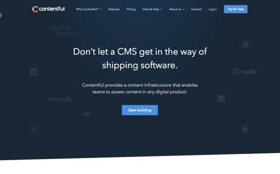
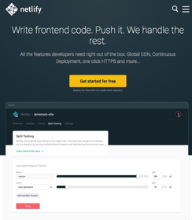

### The JAMstack and LaterPay 

New ways of doing business.

---
#### So who am I?

  ### Bob Walsh

  [47hats](https://47hats.com) 
  [microconsults](https://microconsults.com) 
  [@BobWalsh](https://twitter.com/BobWalsh) 
  Github: [bobwalsh](https://github.com/BobWalsh)
---

### What is the JAMstack?

- JavaScript: React, Angular, or vanilla JS
- APIs: for CMS, shopping carts, or restricting content
- Markup: regular HTML, templated markup
- ...and only a server serving out html files.

---
### Advantages

- Speed: no server means everything happens in the browser
- Security: Communication limited to defined APIs
- Scaling: cheaper and easier when it's just serving files
---

### Examples

- [City of Boston](https://budget.boston.gov/)
- [Serverless](https://serverless.com/)
- [JAMstack site*](https://jamstack.org/)

(Loaded with JAMstack resources)
---

### Implementing a JAMstack

- A static site generator
- A headless CMS
- A serverless server

---
### Static Site Generators:

- Ruby: Jekyll, Middleman, Octopress
- JavaScript: Hexo, GitBook, **Gatsby**
- ...and other languages

---
### Gatsby has traction

- Written in React.js
- Uses GraphQL to pull static content
- Large and growing community
- Plenty of starter projects and demos

---?image=assets/wp.png

### What about Content?

#### Do we have to use WordPress? 😂

### No! Use a headless CMS

### I like [Contentful](https://www.contentful.com/), but there are plenty closed and open source solutions to [choose from](https://headlesscms.org/).

---
### Netlify

##### A perfect platform for JAMstack.

##### (and a generous free tier.)

---
### A quick Demo

#### Gatsby, Contentful and Netlify create a blog.

(The Ruby on Rails demo from 2006...)

---
## Thank you!

---